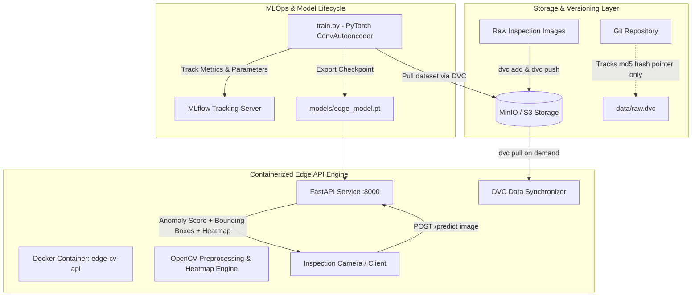

# Edge Device Visual Quality Control & Anomaly Detection

[](https://www.python.org/)
[](https://fastapi.tiangolo.com)
[](https://pytorch.org/)
[](https://dvc.org/)
[](https://mlflow.org/)
[](https://www.docker.com/)

An industrial-grade, edge-compatible visual quality control and anomaly detection system engineered for manufacturing inspection lines. The system resolves edge storage constraints by decoupling heavy image binary datasets from Git repositories using **DVC** with an S3-compatible **MinIO** backend, tracks model experiments via **MLflow**, and serves a lightweight **PyTorch & OpenCV** inference engine packaged inside an optimized **Docker** container.

---

## 📌 1. Overview & Problem Statement

In modern smart manufacturing lines (e.g., metal casting, semiconductor wafer inspection, automotive stamping), optical inspection cameras capture high-resolution images continuously. Deploying quality control systems directly onto edge devices (such as NVIDIA Jetson, industrial IPCs, or embedded gateways) presents three core engineering challenges:

1. **Storage Bottlenecks on Edge Devices**: Edge hardware has strictly limited local disk capacity and cannot retain historical image archives.
2. **Repository Binary Bloat in Git**: Committing binary datasets directly to Git bloats repository size irreversibly, slowing CI/CD pipelines and developer checkouts.
3. **Reproducibility & Model Governance**: Ensuring that deployed inference models are strictly synchronized with the specific dataset version used for training.

### The Solution
- **DVC + MinIO S3 Remote**: Image datasets are version-controlled in an S3-compatible remote object store (MinIO), while Git tracks lightweight `.dvc` content hash pointers (~100 bytes).
- **MLflow Tracking & Model Registry**: Logs hyperparameters, reconstruction loss curves, ROC-AUC curves, and optimal anomaly detection thresholds.
- **Unsupervised ConvAutoencoder (PyTorch & OpenCV)**: Trained exclusively on defect-free parts. Unseen defects (scratches, cracks, voids, contamination) yield high reconstruction error, enabling real-time detection and spatial bounding-box localization without requiring balanced anomalous training sets.
- **FastAPI Edge Inference Engine**: High-throughput, asynchronous REST API serving predictions, visual heatmap overlays, health checks, and automated DVC dataset synchronization.
- **Dockerized Edge Packaging**: Multi-stage, minimal footprint container (< 160MB RAM utilization, sub-30ms CPU inference latency).

---

## 🏗️ 2. System Architecture



---

## 📂 3. Project Structure

```text
edge-anomaly-detection/
├── .dvc/                      # DVC configuration and remote storage pointers
├── data/
│   ├── raw/                   # Raw inspection dataset (tracked by DVC, ignored by Git)
│   │   ├── train/normal/      # Defect-free manufacturing samples for training
│   │   ├── test/normal/       # Normal evaluation samples
│   │   └── test/defective/    # Defective evaluation samples (scratches, cracks, voids, stains)
│   └── raw.dvc                # DVC content hash pointer tracked by Git (~100 bytes)
├── models/
│   ├── edge_model.pt          # PyTorch trained model checkpoint
│   └── model_metadata.json    # Model metadata and calibrated anomaly threshold
├── scripts/
│   ├── create_minio_bucket.py # MinIO S3 bucket initialization utility
│   └── setup_dvc_minio.sh     # DVC remote configuration and dataset sync script
├── src/
│   ├── api/
│   │   ├── app.py             # FastAPI edge inference & data sync server
│   │   └── schemas.py         # Pydantic request/response schema definitions
│   ├── data/
│   │   └── generate_dataset.py # Synthetic manufacturing image and defect generator
│   └── model/
│       └── autoencoder.py     # ConvAutoencoder architecture & EdgeAnomalyDetector
├── tests/
│   ├── test_api.py            # API endpoint integration test suite
│   └── test_model.py          # Model architecture and detector unit tests
├── demo.py                    # End-to-end automated pipeline demonstration
├── Dockerfile                 # Multi-stage optimized edge Dockerfile
├── docker-compose.yml         # Full stack: MinIO + MLflow + Edge CV API
├── Makefile                   # Automation command targets
├── requirements.txt           # Python project dependencies
└── README.md                  # Project documentation
```

---

## ⚡ 4. Quickstart Guide

### Prerequisites
- Python 3.10+
- Git
- Docker & Docker Compose

### 1. Environment Setup
```bash
# Clone repository
git clone https://github.com/Varadha9/edge-device-anomaly-detection.git
cd edge-device-anomaly-detection

# Create virtual environment and install dependencies
make setup
# Or manually:
python3 -m venv .venv
source .venv/bin/activate
pip install -r requirements.txt
```

### 2. Generate Dataset
```bash
# Generates synthetic manufacturing parts with normal surfaces and controlled defect patterns
python src/data/generate_dataset.py --train-normal 120 --test-normal 30 --test-defective 30
```

### 3. Initialize DVC & Configure MinIO Remote
```bash
# Configures DVC remote pointing to MinIO S3 storage and creates data/raw.dvc pointer
bash scripts/setup_dvc_minio.sh
```

### 4. Train Model & Track with MLflow
```bash
# Trains ConvAutoencoder, logs metrics to MLflow, and exports models/edge_model.pt
python src/train.py --epochs 15 --batch-size 16 --lr 0.001
```

### 5. Run End-to-End Pipeline Demo
```bash
# Executes dataset verification, model calibration, and batch quality control evaluation
python demo.py
```

### 6. Start Local API Server
```bash
# Launch FastAPI development server on port 8000
uvicorn src.api.app:app --host 0.0.0.0 --port 8000 --reload
```

---

## 🐳 5. Docker & Orchestration

The project includes a complete `docker-compose.yml` stack orchestrating:
1. **MinIO (`edge-minio`)**: S3-compatible remote storage for dataset binaries.
2. **MinIO Initializer (`edge-minio-mc`)**: Automatic bucket creation service.
3. **MLflow Server (`edge-mlflow`)**: Centralized experiment tracking and model registry.
4. **Edge Inference API (`edge-cv-api`)**: Containerized inspection service.

### Launch Containers
```bash
# Build and start all services in background
docker compose up -d

# Verify container health
docker compose ps
```

### Service Endpoints
| Service | URL | Description |
| :--- | :--- | :--- |
| **Edge Inspection API** | [http://localhost:8000](http://localhost:8000) | Core inference API |
| **Interactive Swagger Docs** | [http://localhost:8000/docs](http://localhost:8000/docs) | OpenAPI interactive documentation |
| **MinIO S3 Console** | [http://localhost:9001](http://localhost:9001) | User: `minioadmin` / Pass: `minioadmin` |
| **MLflow Dashboard** | [http://localhost:5000](http://localhost:5000) | Experiment tracking & model metrics |

---

## 📡 6. REST API Specification

### `POST /predict`
Performs visual anomaly detection on an uploaded inspection image.

- **Request**: Multipart Form Data (`file`: Image PNG/JPEG, `custom_threshold`: Optional float)
- **Response**:
```json
{
  "is_defective": true,
  "verdict": "DEFECTIVE",
  "anomaly_score": 0.079070,
  "threshold": 0.017040,
  "defect_confidence": 1.0,
  "latency_ms": 24.5,
  "detected_defect_count": 1,
  "bounding_boxes": [
    {
      "x": 89,
      "y": 69,
      "w": 21,
      "h": 21
    }
  ],
  "heatmap_base64": "data:image/png;base64,iVBORw0KGgo..."
}
```

- **Example cURL**:
```bash
curl -X POST http://localhost:8000/predict \
  -F "file=@data/raw/test/defective/defective_0001_void_hole.png"
```

---

### `POST /predict/overlay`
Returns the annotated part image directly as JPEG binary stream with colored defect heatmap and bounding boxes.

- **Example cURL**:
```bash
curl -X POST http://localhost:8000/predict/overlay \
  -F "file=@data/raw/test/defective/defective_0003_scratch.png" \
  -o inspected_part_overlay.jpg
```

---

### `POST /sync-data`
Triggers an on-demand `dvc pull` to synchronize raw inspection datasets from the remote MinIO/S3 bucket without touching code repositories.

- **Response**:
```json
{
  "status": "success",
  "message": "Dataset synchronized successfully from remote storage. Everything is up to date.",
  "synced_files_count": 0,
  "duration_seconds": 3.42
}
```

---

### `GET /health`
Returns system status, active execution device, memory utilization, and DVC readiness.

- **Response**:
```json
{
  "status": "healthy",
  "device": "cpu",
  "model_loaded": true,
  "memory_usage_mb": 151.25,
  "dvc_configured": true
}
```

---

### `GET /model-info`
Returns active model architecture, input resolution, and operational decision threshold.

---

## 📊 7. Benchmarks & Performance Metrics

| Evaluation Metric | Measured Performance | Note |
| :--- | :--- | :--- |
| **ROC-AUC Score** | **98.56%** (0.9856) | High discrimination between normal and defective parts |
| **Best F1-Score** | **94.92%** (0.9492) | Calibrated at optimal threshold boundary |
| **Precision** | **96.55%** (0.9655) | Minimal false alarm rate |
| **Recall** | **93.33%** (0.9333) | Robust defect capture rate |
| **Optimal Threshold** | **0.017040** | Determined via F1 maximization |
| **Inference Latency** | **14 - 28 ms** | Tested on standard CPU (Edge-ready) |
| **RAM Footprint** | **~151 MB** | Containerized memory utilization |

---

## 🧪 8. Automated Testing

The repository includes comprehensive unit and integration tests covering model tensors, anomaly score calculations, heatmap rendering, and all FastAPI endpoints:

```bash
# Run pytest suite
pytest tests/ -v
```

---

## 🛠️ 9. Makefile Automation Commands

| Command | Action |
| :--- | :--- |
| `make setup` | Create virtual environment and install dependencies |
| `make data` | Generate synthetic visual quality inspection dataset |
| `make dvc-setup` | Initialize DVC and configure MinIO S3 remote |
| `make train` | Train ConvAutoencoder and log metrics to MLflow |
| `make test` | Execute test suite with Pytest |
| `make api` | Launch local FastAPI development server |
| `make demo` | Run end-to-end quality control pipeline demo |
| `make up` | Start full Docker Compose stack (MinIO + MLflow + Edge API) |
| `make down` | Tear down Docker Compose containers |

---

## 📄 10. License

This project is licensed under the MIT License - see the LICENSE file for details.
